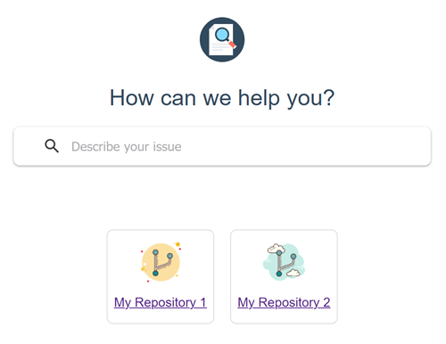

# mkdocs-multirepo

[](https://badge.fury.io/py/mkdocs-multirepo)

A bit like [monorepo](https://github.com/spotify/mkdocs-monorepo-plugin), but keeps MkDocs projects separate.

> **Note: This tool is in beta.** 

## Use Case

This CLI tool allows you to build multiple MkDocs documentation projects and generate a landing page for them:



Unlike [monorepo](https://github.com/spotify/mkdocs-monorepo-plugin), multirepo doesn't merge projects into one. 

Instead, multirepo adds the MkDocs projects as Git submodules, builds them individually, and generates an HTML landing page based on a template file.

This has a number of advantages, for example:

- Keeps the individual mkdocs.yml settings of each project. This means that, e.g., each project can have its own color set or theme.
- Avoids problems with relative paths in the projects.
- Keeps search indexes small instead of creating a giant merged index.

## Installation

1. Install via `pip install mkdocs-multirepo`.
2. Create a directory and put two files named `config.yml` and `index.tpl` in it.
3. Configure the files as described below.
4. Change to the directory created in step 1.
5. Run `git init`.
6. Run `mkdocs-multirepo --init`.

## Usage

```
Usage: mkdocs-multirepo [OPTIONS]

Options:
  --init      Initialize the repos as Git submodules.  [default: False]
  --update    Update the repos, i.e., the Git submodules.  [default: False]
  --build     Build all MkDocs projects and generate the landing page.
              [default: False]
```

## Configuration

### Sample Project

See `mkdocs_multirepo/demo` for a sample project. 

> **Note:** Search is not functional. You must implement it yourself, e.g., using [Docsearch](https://docsearch.algolia.com/).

### config.yml

Use the `config.yml` file to configure the build process. Example:

```yml
repos:
  - name: repo-1
    title: My Repository 1
    image: images/icon-repo-1.png
    url: https://github.com/giansalex/mkdocs-sample.git
    mkdocs_dir: '.'
  - name: repo-2
    title: My Repository 2
    image: images/icon-repo-2.png
    url: https://github.com/hristo-mavrodiev/mkdocs-sample.git
    branch: testing
    index_html: 01_index.html
element_id: multirepo
target_dir: site
repos_dir: repositories
index_tpl: index.tpl
extra_files:
    - styles.css
```

Each entry under `repos` configures an MkDocs project:

- `name`: Used to create the Git Submodule directory and also the output directory within `target_dir`.
- `title`: Text for the landing page list item.
- `image`: Image for the landing page list item.
- `url`: URL of the repository.
- 'branch': Branch of the repository. Default: empty (which is `master` for most of the repositories).
- 'mkdocs_dir': Directory (within repo) where the mkdocs directory structure is located. Default: '.'.
- 'index_html': Index html file for this repository. Default: 'index.html'.
- 'pdf': Link to pdf file.
- 'element_id': ID of the DOM element on the landing page where the links to the this repo project should be created. Default: from config.

`element_id`: ID of the DOM element on the landing page where the links to the projects should be created. Default: `multirepo`.

`target_dir`: Output directory. Default: `site`.

`repos_dir`: Target directory for repositories (submodules). Default: `repositories`.

`extra_files`: Additional files to be placed in the output directory.

`index_tpl`: Path to index template. Default: `index.tpl`

### index.tpl

Use the `index.tpl` file to configure the landing page. Example:

```yml
<html>
    <head>
        <title>Multirepo Demo Page</title>
        <link rel="stylesheet" type="text/css" href="styles.css">
    </head>
    <body>
        <section id="multirepo"></section>
    </body>
</html>
```

The template must be written in HTML and must contain a node with an ID called "multirepo" or as defined using the `element_id` setting.

From this template, a landing page named `index.html` will be generated and placed into `target_dir`.

Sample output:

```html
<html>
    <head>
        <title>Multirepo Demo Page</title>
        <link href="styles.css" rel="stylesheet" type="text/css" />
    </head>
    <body>
        <section id="multirepo">
            <ul>
                <li><a href="repo-1/index.html"><span>My Repository 1</span></a></li>
                <li><a href="repo-2/01_index.html"><span>My Repository 2</span></a></li>
            </ul>
        </section>
    </body>
</html>
```
